<p align="center">
  
</p>

<h3 align="center">TikTok Scheduler</h3>

<p align="center">
  A desktop GUI tool for bulk scheduling/uploading videos to TikTok<br/>
  using browser automation, no API keys required.
</p>

<p align="center">
  
  
  
  
  
</p>

## About

**TikTok Scheduler** is a desktop application that automates bulk video scheduling on TikTok. It uses Playwright to control a real Chromium browser behind the scenes, interacting with TikTok's web upload page exactly as a user would, filling in captions, setting future schedule dates, and submitting the upload.

### Key Features

- **Bulk scheduling**: Scan a folder of `.mp4` files and schedule them all in one batch
- **Smart time slots**: Auto-generate evenly spaced schedule slots across a configurable date range
- **Multi-account**: Switch between accounts via cookie-based session management
- **Folder history**: Dropdown with previously used video folders
- **Published tracking**: Automatically tracks which videos have been published and prevents re-uploads
- **Schedule rules**: Configurable time windows, intervals, randomization, and daily limits
- **Headless mode**: Run browser automation in the background without a visible window
- **Copyright check**: Detects potential copyright music issues during upload
- **Dark neumorphic UI**: Modern, polished dark-themed interface

## How It Works

```mermaid
flowchart TB
    U(["👤 User"]) --> A["Select Account"]
    A --> B["Browse Video Folder"]
    B --> C["Scan .mp4 Files"]
    C --> D["Configure Date Range & Time Window"]
    D --> E["Generate Schedule Slots"]
    E --> F["Start Upload"]

    F --> G{"For Each Video"}
    G --> H["Open TikTok Upload Page"]
    H --> I["Upload Video File"]
    I --> J["Set Caption & Hashtags"]
    J --> L["Set Schedule Date & Time"]
    L --> M["Click Schedule Button"]
    M --> N["Wait for Success Toast"]
    N --> O["Log Result"]
    O -->|"Next Video"| G

    O --> P["Save to schedules/@user.json"]
    P --> Q["Migrate to publishes/@user.json"]

    H -.->|"Headless or Visible"| R["Chromium Instance"]
    R -.->|"DOM Automation"| S["TikTok Web Creator"]
```



## Installation

### Prerequisites

- **Python 3.10+** — [Download here](https://www.python.org/downloads/)
- **Windows OS** (tested on Windows 10/11)

### Step 1 — Clone the Repository

```bash
git clone https://github.com/davins/tiktok-scheduler.git
cd tiktok-scheduler
```

### Step 2 — Install Python Dependencies

```bash
pip install -r requirements.txt
```

### Step 3 — Install Playwright Chromium

Playwright requires a Chromium browser binary to be downloaded separately:

```bash
python -m playwright install chromium
```

> [!TIP]
> You can skip Steps 2-3 entirely by using **RUN.bat** — it automatically checks and installs everything for you.

## Running the App

### Option A: Double-click `RUN.bat`

The easiest way. Just double-click `RUN.bat` in the project root. It will:

1. ✅ Check that Python is available
2. ✅ Install any missing pip packages
3. ✅ Install Playwright Chromium if not found
4. ✅ Launch the application

### Option B: Terminal

```bash
python main.py
```

## Adding an Account

TikTok Scheduler uses **cookie-based authentication** (no username/password needed):

1. Log in to [TikTok Creator](https://www.tiktok.com/creator) in your browser
2. Export your cookies as JSON (using a browser extension like [_Cookie-Editor_](https://chromewebstore.google.com/detail/cookie-editor/hlkenndednhfkekhgcdicdfddnkalmdm))
3. In the app, click the **+** button next to the account dropdown
4. Enter your TikTok username and paste the cookie JSON
5. Click **Save** — the account is ready to use

An example cookie format is provided in `example_cookie.json`.

## Configuration

Edit `config.json` to customize behavior:

| Key                              | Description                                | Default   |
| -------------------------------- | ------------------------------------------ | --------- |
| `headlessDefault`                | Run browser without UI                     | `true`    |
| `logLevel`                       | Log verbosity (`DEBUG`, `INFO`, `WARNING`) | `DEBUG`   |
| `primaryColor`                   | UI accent color (hex)                      | `#1E66FF` |
| `scheduleRules.minOffsetMinutes` | Minimum minutes from now for scheduling    | `15`      |
| `scheduleRules.maxOffsetMonths`  | Maximum months ahead for scheduling        | `1`       |
| `scheduleRules.minuteStep`       | Minute granularity for time slots          | `5`       |

---

## 📁 Project Structure

```
tiktok-scheduler/
├── main.py                  # App entry point
├── config.json              # Runtime configuration
├── setup.py                 # Dependency checker / installer
├── RUN.bat                  # One-click Windows launcher
├── requirements.txt         # Python dependencies
│
├── core/                    # Core business logic
│   ├── browser_manager.py   # Playwright browser lifecycle
│   ├── config_manager.py    # Config loading & validation
│   ├── cookie_manager.py    # Cookie I/O & session injection
│   ├── dom_handler.py       # TikTok page DOM automation
│   ├── schedule_rule_engine.py  # Time slot validation rules
│   ├── scheduler.py         # Slot generation engine
│   ├── uploader.py          # Upload orchestration
│   └── logger_manager.py    # Logging facade
│
├── gui/                     # PyQt6 GUI layer
│   ├── main_window.py       # Main window layout
│   ├── controller.py        # Signal handling & state management
│   ├── components.py        # Reusable widget components
│   └── styles.py            # Neumorphic dark theme stylesheet
│
├── utils/                   # Shared utilities
├── assets/                  # App icon
├── storage/                 # Runtime data (gitignored)
│   ├── schedules/           # Per-user schedule records
│   └── publishes/           # Per-user published records
└── cookies/                 # Session cookies (gitignored)
```

---

## License

This project is licensed under the [MIT License](LICENSE).
